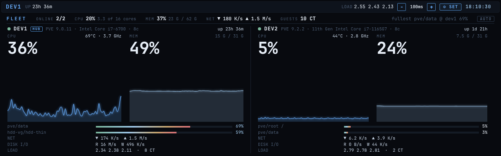
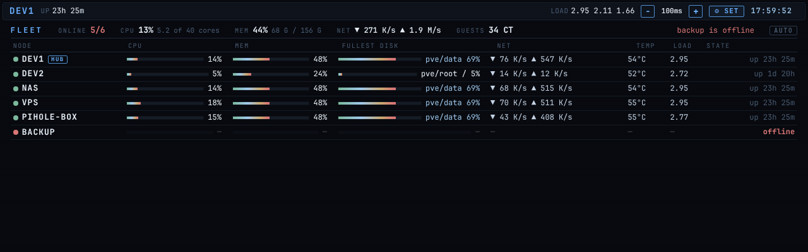
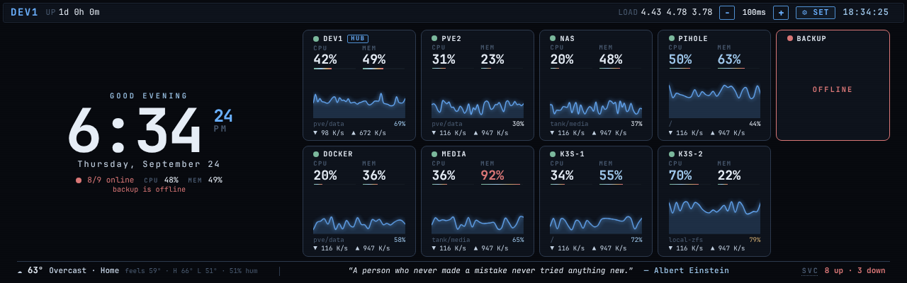

<!--
  Rendered logo lives in assets/logo.txt — this fenced block is the same
  rendering, kept here so GitHub shows it without a separate image.
-->

```
██╗   ██╗ ██╗  ██████╗   ██████╗  ███████╗ ██╗  ██╗
██║   ██║ ██║ ██╔════╝  ██╔═══██╗ ██╔════╝ ██║ ██╔╝
██║   ██║ ██║ ██║  ███╗ ██║   ██║ ███████╗ █████╔╝
╚██╗ ██╔╝ ██║ ██║   ██║ ██║   ██║ ╚════██║ ██╔═██╗
 ╚████╔╝  ██║ ╚██████╔╝ ╚██████╔╝ ███████║ ██║  ██╗
  ╚═══╝   ╚═╝  ╚═════╝   ╚═════╝  ╚══════╝ ╚═╝  ╚═╝
```

# vigosk

A terminal-styled system metrics dashboard for Linux. Renders CPU, memory, GPU, disk, network and ping in a fullscreen Chromium kiosk with a `btop`-meets-`htop` aesthetic — but built on the web stack, so it's easy to theme, lay out, and remote-view.

**New in 0.2: multi-node.** Add your other machines (a second Proxmox node, a NAS, a Pi…) and see them all side by side on one screen. Pairing is one pasted command, agents never open a port, and everything is encrypted and sandboxed. → [Multi-node guide](docs/MULTINODE.md)



---

## Contents

- [Install](#install) · [Usage](#usage) · [Keyboard](#keyboard)
- [Multi-node (FLEET)](#multi-node-fleet) — full guide in [docs/MULTINODE.md](docs/MULTINODE.md)
- [Layouts](#layouts) · [Themes](#themes) · [Graph modes](#graph-modes)
- [Running as a real kiosk](#running-as-a-real-kiosk-panel-boot) · [Architecture](#architecture) · [Security](#security)

---

## Install

```sh
curl -fsSL https://raw.githubusercontent.com/gabegaglio/vigosk/main/install.sh | sh
```

Installs to `~/.local/share/vigosk` and drops a launcher at `~/.local/bin/vigosk`. Run with `sudo` to install system-wide under `/usr/local`. **System-wide is required if this machine will be a multi-node hub.**

> **Multi-node needs vigosk 0.2.0+.** Until the 0.2.0 release is published, install from the main branch:
> `curl -fsSL https://raw.githubusercontent.com/gabegaglio/vigosk/main/install.sh | sudo VIGOSK_VERSION=main sh`

Then:

```sh
vigosk
```

The terminal switches to the alternate screen buffer (like `btop`), the metrics server starts on `127.0.0.1:8765`, and your browser opens the dashboard (`--kiosk` for fullscreen Chromium). Exit with `Esc` → `QUIT` (or kill the terminal) — the alt-screen restores cleanly.

### Requirements

- Linux (X session for kiosk mode; headless works in `--server-only` mode)
- `python3` (3.8+) and `python3-psutil` (the installer adds it)
- `chromium` or `chromium-browser` or `google-chrome` (optional — only needed for kiosk mode)
- `curl`, `tar` (only for installation)
- Multi-node hub only: `systemd` and `openssl`

---

## Usage

```
vigosk [OPTIONS]

  -h, --help           show help and exit
  -v, --version        print version and exit
  -p, --port PORT      bind port for the metrics server   [default: 8765]
      --host HOST      bind address                       [default: 127.0.0.1]
      --kiosk          fullscreen chromium kiosk mode
      --server-only    start the server but don't open a browser
      --no-clear       don't use the terminal alt-screen buffer
      --braille-logo   print the braille V-TERM easter-egg logo and exit

vigosk hub enable|disable|status      make this machine a multi-node hub
vigosk node add|list|remove|rekey     pair and manage other machines
```

### Environment

| Variable          | Purpose                                              |
| ----------------- | ---------------------------------------------------- |
| `VIGOSK_HOME`     | Override install location (where `metrics.py` lives) |
| `VIGOSK_BROWSER`  | Browser binary to launch (default: chromium)         |
| `VIGOSK_HOST`     | Bind address — same as `--host`                      |
| `VIGOSK_PORT`     | Bind port — same as `--port`                         |
| `VIGOSK_CONFIG`   | Path to the runtime config JSON (ping targets, container watch list, weather). Defaults next to `metrics.py`, else `~/.config/vigosk/config.json` |
| `VIGOSK_ALLOWED_HOSTS` | Comma-separated hostnames allowed to use the dashboard API besides IPs and `localhost` — needed when you view it through a reverse proxy by name (see [OPTIONAL.md](./OPTIONAL.md)) |
| `VIGOSK_HUB_SOCKET` | Multi-node hub control socket (default `/run/vigosk-hub/hub.sock`) |
| `PING_EXT`        | Default external ping target (default: `1.1.1.1`); the Settings → NETWORK field overrides it at runtime |
| `PING_DNS`        | Default DNS-test ping target (default: `google.com`) |
| `WAN_IFACE`       | WAN interface for net stats (auto-detected if unset) |
| `LAN_IFACES`      | LAN interfaces for net stats (auto-detected if unset)|

### Runtime settings (Kiosk Settings → `S`)

Some settings are editable live from the kiosk UI and persisted server-side (the work happens in `metrics.py`), so they survive restarts:

- **NETWORK** — gateway, external and DNS-test ping targets. Blank gateway = auto-detect the default route; every field accepts an IP or hostname and is validated before saving.
- **CONTAINERS** — a watch list of `name → host` targets pinged for up/down health (up = green, down = red, pending = neutral). The probe **interval** (default 5 s) and a **max-per-cycle** cap (default 8) are configurable; when the list is longer than the cap the pings stagger across cycles so the host isn't flooded. The CONTAINERS widget autohides until at least one target is configured.
- **WEATHER** — current conditions for the HUB layouts, from the keyless [Open-Meteo](https://open-meteo.com) API. **Off by default** (a fresh install makes no outbound request); set latitude / longitude, °C / °F and a label to turn it on. The fetch is done server-side against one fixed HTTPS host, so the page never talks to a third party.

---

## Keyboard

| Key       | Action                                                          |
| --------- | --------------------------------------------------------------- |
| `Esc`     | open / close the VIGOSK menu                                    |
| `S`       | settings                                                        |
| `W`       | widgets                                                         |
| `L`       | layouts                                                         |
| `G`       | toggle line / braille graph mode                                |
| `T`       | theme picker                                                    |
| `A` · `D` | previous / next theme                                           |
| `1` – `9` | default · gauges · heatmap · flowstrip · minimal · hub · hub·cards · fleet · hub·fleet |
| `V`       | FLEET layout: cycle auto / columns / list view                  |
| `↑ ↓ ← →` | navigate menu actions                                           |
| `Enter`   | activate focused action                                         |
| `?`       | show in-app help overlay                                        |

---

## Multi-node (FLEET)

Watch several machines from one screen. The machine with the screen is the **hub**; every other machine runs a tiny **agent** (one Python file, standard library only, ~0.1 % of a CPU core) that pushes its stats to the hub over TLS.

```sh
# 1 · on the hub (the machine with the screen)
sudo vigosk hub enable            # then allow TCP 8767 from your LAN in its firewall

# 2 · still on the hub — prints a one-line command for the new machine
sudo vigosk node add nas

# 3 · on "nas", as root — paste the line it printed, e.g.
curl -fsSL https://raw.githubusercontent.com/gabegaglio/vigosk/main/agent/install.sh | sh -s -- vgk1.eyJ1…
```

Press `8` on the hub (or `9` for the clock + machine-cards version). Each machine gets a column (5+ machines switch to a list), with a combined summary on top; tap any machine for cores, disks and top processes. Both layouts re-fit themselves as you add machines. Proxmox users: add `--privileged` to the agent command to also see LVM-thin (`local-lvm`) usage.

The step-by-step guide covers firewalls (Proxmox, ufw, firewalld), Tailscale, day-to-day commands, troubleshooting and the security model: **[docs/MULTINODE.md](docs/MULTINODE.md)**.

---

## Layouts

Nine built-in layouts, switch with `1`–`9` or the picker (`L`).

**default** — six-row strip: CPU, MEM, GPU, DISK, NET, PING.


**gauges** — dial-based; foreground metric large, supporting metrics small.


**heatmap** — temporal density view across cores.


**flowstrip** — six-column dense row, uniformly accented.


**minimal** — data-first: a top row of oversized vital percentages (CPU · MEM · DISK · GPU) meant to be read across a room, over a ledger of tightly-aligned tables (processes · network · containers). No graphs, no boxes — alignment grid only. Pairs naturally with the `minimal` theme but reads cleanly under any.

**hub** — an ambient home-screen: a large centred clock and greeting, today's weather on one line under the date, a quote of the day, and a slim vitals footer (host · CPU · MEM · DISK · TEMP · uptime · services). Tap **SVC** in the footer for the up/down list of your watched containers.

**hub · cards** — the same content as two columns: the clock on the left, weather and the quote as cards on the right.

**fleet** — every paired machine on one screen: a combined summary strip over one column per machine (or a list for five or more). The list shrinks its rows as machines are added and flows into extra columns, so dozens of machines still fit without scrolling. See [Multi-node](#multi-node-fleet).



**hub · fleet** — the hub clock on the left, a card per machine on the right, and weather · quote of the day · services as a banner along the bottom. Add a machine and the cards re-tile to fit (1 → 3 across → 2×2 → 3×2 → … → 9×5), shedding detail as they shrink: graph, then disk/network rows, then down to a one-line `CPU · MEM` readout. Offline machines turn red and say so at every size.



Each layout has its own widget config (slots on/off, order). Reset a layout to defaults via the `↻` on its swatch in the picker (`L`), or via the Widgets modal (`W`) for the active layout.

## Themes

Ten terminal-friendly themes (cyberpunk, wireframe, e-ink, amber, matrix, solarized, pink, purple, midnight, minimal). Cycle with `A`/`D`; pick directly via `T`, or open Settings (`S`) → `APPEARANCE` → `THEME` to cycle inline. The choice persists in `localStorage` (`kiosk.theme`).

**minimal** — a data-first theme that strips the borders, gradients, accent stripes, scanlines and bar glow in favor of whitespace and alignment. Near-monochrome by design: each widget leads with its primary metric as the large legible value, labels are muted, and a single warm accent is reserved strictly for threshold/alert states (a value crossing its warn/crit bound, a container going down) so colour carries information rather than style. Works across every layout and scales to the same screen sizes as the other themes.

## Graph modes

`G` toggles between two rendering styles:

- **line** — anti-aliased SVG line graphs.
- **braille** — text-cell-aligned braille-character graphs, like `btop`'s default.

---

## Architecture

```
            the machine with the screen                         other machines
  ┌─ chromium (kiosk) ─┐   ┌─ python3 metrics.py ──────┐      ┌─ vigosk-agent ──────┐
  │  index.html        │   │  127.0.0.1:8765           │      │  reads /proc, /sys  │
  │  app.js            │◄─►│  • /  /static/…           │      │  every 2 s          │
  │  layouts.js        │   │  • /api/stats  (10 Hz)    │      │  (no open ports)    │
  │  fleet.js          │   │  • /api/config            │      └─────────┬───────────┘
  └────────────────────┘   │  • /api/fleet ─────┐      │                │ HTTPS push,
                           │  daemon samplers:  │      │                │ pinned cert
                           │  fast/proc/ping/   │      │                ▼
                           │  gpu/containers/   │ unix │   ┌─ fleet.py (vigosk-hub) ──┐
                           │  weather           │ sock │   │  0.0.0.0:8767 TLS        │
                           └────────────────────┼──────┘   │  unprivileged, sandboxed │
                                                └─────────►│  latest + 6 min history  │
                                                           └──────────────────────────┘
```

`metrics.py` is a stdlib `ThreadingHTTPServer`. Sampler threads write into a shared dict under a lock; the HTTP handlers just serialize the latest dict, so `/api/stats` is always sub-millisecond and the kiosk never freezes when something heavy (process enumeration) is in flight. The kiosk page polls `/api/stats` and re-renders client-side; nothing on the page reloads, only the data.

Multi-node adds two optional pieces: `fleet.py` (the hub, a separate unprivileged service and the only network-facing listener) and `agent/vigosk_agent.py` (the agent, one stdlib-only file). Single-machine installs never start either. Details: [docs/MULTINODE.md → Under the hood](docs/MULTINODE.md#under-the-hood).

---

## Security

- The dashboard listens on **`127.0.0.1` only** by default and has no login — it's meant for the kiosk itself. If you expose it (see [OPTIONAL.md](./OPTIONAL.md)), put authentication in front.
- The API refuses requests arriving under unknown hostnames (blocks DNS-rebinding attacks from websites open in a browser on the same machine) and refuses cross-site or non-JSON settings writes. Pages are served with a strict Content-Security-Policy.
- Multi-node: agents only dial out; the hub pins its own certificate into every single-use pairing code; secrets are stored hashed; hub and agent run sandboxed under systemd with resource caps; every value an agent sends is validated and rendered as plain text. Full model: [docs/MULTINODE.md → Security](docs/MULTINODE.md#security).
- Report vulnerabilities privately — see [SECURITY.md](./SECURITY.md).

---

## Running as a real kiosk (panel boot)

`vigosk` works fine as a CLI from your normal session, but the original use case is a dedicated panel that boots straight into the dashboard. The included `kiosk.sh` is designed to be launched from `~/.xinitrc` on `tty1`:

```sh
# ~/.xinitrc
exec /usr/local/share/vigosk/kiosk.sh
```

And `vigosk-metrics.service` keeps the server up across reboots:

```ini
[Unit]
Description=vigosk metrics server
After=network.target

[Service]
Type=simple
ExecStart=/usr/bin/python3 /usr/local/share/vigosk/metrics.py
Restart=on-failure
RestartSec=3

[Install]
WantedBy=multi-user.target
```

To turn the panel into a multi-node hub, run `sudo vigosk hub enable` — see [docs/MULTINODE.md](docs/MULTINODE.md).

See [`OPTIONAL.md`](./OPTIONAL.md) for remote-viewing via nginx and an on-demand screenshot endpoint.

---

## License

[MIT](./LICENSE) — © 2026 Gabriel Gaglio. Fork, modify, and redistribute freely; keep the copyright notice intact.
