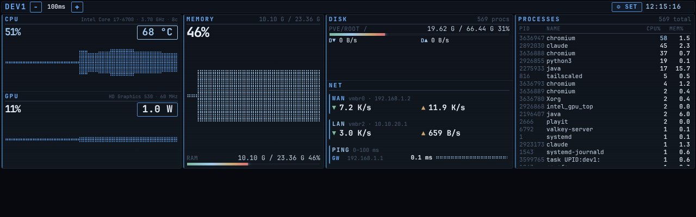
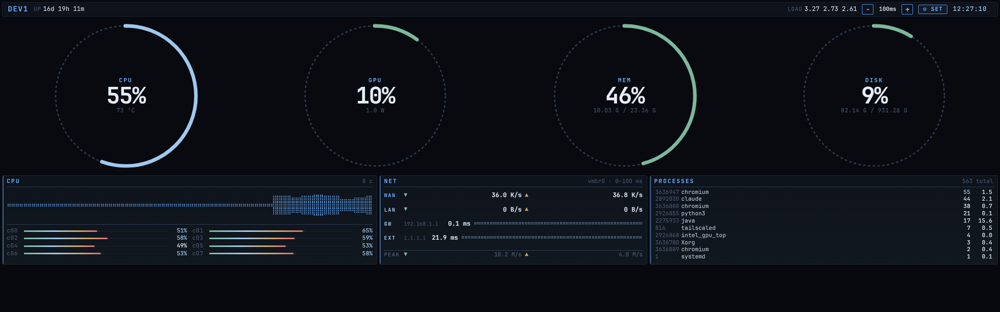
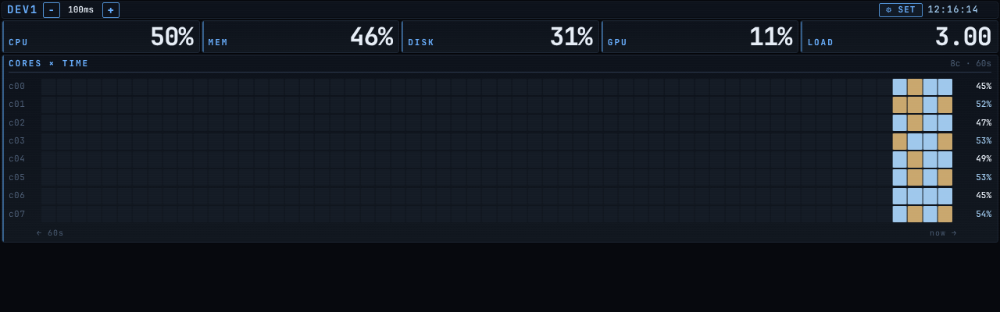
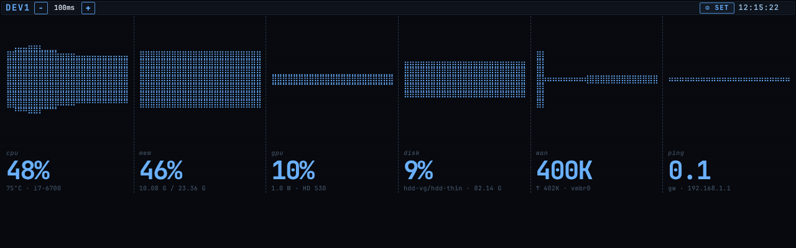

<!--
  Rendered logo lives in assets/logo.txt — this fenced block is the same
  rendering, kept here so GitHub shows it without a separate image.
-->

```
██╗   ██╗ ██╗  ██████╗   ██████╗  ███████╗ ██╗  ██╗
██║   ██║ ██║ ██╔════╝  ██╔═══██╗ ██╔════╝ ██║ ██╔╝
██║   ██║ ██║ ██║  ███╗ ██║   ██║ ███████╗ █████╔╝
╚██╗ ██╔╝ ██║ ██║   ██║ ██║   ██║ ╚════██║ ██╔═██╗
 ╚████╔╝  ██║ ╚██████╔╝ ╚██████╔╝ ███████║ ██║  ██╗
  ╚═══╝   ╚═╝  ╚═════╝   ╚═════╝  ╚══════╝ ╚═╝  ╚═╝
```

# vigosk

A terminal-styled system metrics dashboard for Linux. Renders CPU, memory, GPU, disk, network and ping in a fullscreen Chromium kiosk with a `btop`-meets-`htop` aesthetic — but built on the web stack, so it's easy to theme, lay out, and remote-view.


---

## Install

```sh
curl -fsSL https://raw.githubusercontent.com/gabegaglio/vigosk/main/install.sh | sh
```

Installs to `~/.local/share/vigosk` and drops a launcher at `~/.local/bin/vigosk`. Run with sudo to install system-wide under `/usr/local`.

Then:

```sh
vigosk
```

The terminal switches to the alternate screen buffer (like `btop`), the metrics server starts on `127.0.0.1:8765`, and Chromium opens in `--kiosk` mode. Exit with `Esc` → `QUIT` (or kill the terminal) — the alt-screen restores cleanly.

### Requirements

- Linux (X session for kiosk mode; headless works in `--server-only` mode)
- `python3` (3.8+)
- `chromium` or `chromium-browser` or `google-chrome` (optional — only needed for kiosk mode)
- `curl`, `tar` (only for installation)

---

## Usage

```
vigosk [OPTIONS]

  -h, --help           show help and exit
  -v, --version        print version and exit
  -p, --port PORT      bind port for the metrics server   [default: 8765]
      --host HOST      bind address                       [default: 127.0.0.1]
      --server-only    start the server but don't launch chromium
      --no-clear       don't use the terminal alt-screen buffer
      --braille-logo   print the braille V-TERM easter-egg logo and exit
```

### Environment

| Variable          | Purpose                                              |
| ----------------- | ---------------------------------------------------- |
| `VIGOSK_HOME`     | Override install location (where `metrics.py` lives) |
| `VIGOSK_BROWSER`  | Browser binary to launch (default: chromium)         |
| `VIGOSK_HOST`     | Bind address — same as `--host`                      |
| `VIGOSK_PORT`     | Bind port — same as `--port`                         |
| `VIGOSK_CONFIG`   | Path to the runtime config JSON (ping targets + container watch list). Defaults next to `metrics.py`, else `~/.config/vigosk/config.json` |
| `PING_EXT`        | Default external ping target (default: `1.1.1.1`); the Settings → NETWORK field overrides it at runtime |
| `WAN_IFACE`       | WAN interface for net stats (auto-detected if unset) |
| `LAN_IFACES`      | LAN interfaces for net stats (auto-detected if unset)|

### Runtime settings (Kiosk Settings → `S`)

Some settings are editable live from the kiosk UI and persisted server-side
(the pings run in `metrics.py`), so they survive restarts:

- **NETWORK** — gateway + external ping targets. Blank gateway = auto-detect
  the default route (the original behavior); either field accepts an IP or
  hostname and is validated before saving.
- **CONTAINERS** — a watch list of `name → host` targets pinged for up/down
  health (up = green, down = red, pending = neutral). The probe **interval**
  (default 5 s) and a **max-per-cycle** cap (default 8) are configurable; when
  the list is longer than the cap the pings stagger across cycles so the host
  isn't flooded. The CONTAINERS widget autohides until at least one target is
  configured.

---

## Keyboard

| Key       | Action                                                          |
| --------- | --------------------------------------------------------------- |
| `Esc`     | open / close the VIGOSK menu                                    |
| `S`       | settings                                                        |
| `W`       | widgets                                                         |
| `L`       | layouts                                                         |
| `G`       | toggle line / braille graph mode                                |
| `T`       | theme picker                                                    |
| `A` · `D` | previous / next theme                                           |
| `1` – `5` | default · gauges · heatmap · flowstrip · minimal layout         |
| `↑ ↓ ← →` | navigate menu actions                                           |
| `Enter`   | activate focused action                                         |
| `?`       | show in-app help overlay                                        |

---

## Layouts

Five built-in layouts, cycle with `1`–`5`.

**default** — six-row strip: CPU, MEM, GPU, DISK, NET, PING.



**gauges** — dial-based; foreground metric large, supporting metrics small.



**heatmap** — temporal density view across cores.



**flowstrip** — six-column dense row, uniformly accented.



**minimal** — data-first: a top row of oversized vital percentages (CPU · MEM · DISK · GPU) meant to be read across a room, over a ledger of tightly-aligned tables (processes · network · containers). No graphs, no boxes — alignment grid only. Pairs naturally with the `minimal` theme but reads cleanly under any. Select with `5` (or the layout picker, `L`).

Each layout has its own widget config (slots on/off, order). Reset a layout to defaults via the `↻` on its swatch in the picker (`L`), or via the Widgets modal (`W`) for the active layout.

## Themes

Multiple terminal-friendly themes (cyber, amber, nord-ish, etc.). Cycle with `A`/`D`; pick directly via `T`, or open Settings (`S`) → `APPEARANCE` → `THEME` to cycle inline. The choice persists in `localStorage` (`kiosk.theme`).

**minimal** — a data-first theme that strips the borders, gradients, accent stripes, scanlines and bar glow in favor of whitespace and alignment. Near-monochrome by design: each widget leads with its primary metric as the large legible value, labels are muted, and a single warm accent is reserved strictly for threshold/alert states (a value crossing its warn/crit bound, a container going down) so colour carries information rather than style. Works across all four layouts and scales to the same screen sizes as the other themes.

## Graph modes

`G` toggles between two rendering styles:

- **line** — anti-aliased SVG line graphs.
- **braille** — text-cell-aligned braille-character graphs, like `btop`'s default.

---

## Architecture

```
  ┌─ python3 metrics.py ──┐         ┌─ chromium --kiosk ──┐
  │  HTTP on 127.0.0.1    │ ◄──────►│  http://127.0.0.1   │
  │  • /                  │         │       :8765         │
  │  • /api/stats         │         │                     │
  │  • /static/...        │         │  → index.html       │
  └───────────────────────┘         │  → app.js sampler   │
           ▲                        │  → layouts.js       │
           │  daemon samplers:      │  → themes.css       │
           │  fast / proc /         └─────────────────────┘
           │  ping / gpu
           │  (lock-guarded dict, sub-ms read on the request path)
```

`metrics.py` is a stdlib `ThreadingHTTPServer`. Sampler threads write into a shared dict under a lock; the HTTP handlers just serialize the latest dict, so `/api/stats` is always sub-millisecond and the kiosk never freezes when something heavy (process enumeration) is in flight.

The kiosk page polls `/api/stats` and re-renders client-side; nothing on the page reloads, only the data.

---

## Running as a real kiosk (panel boot)

`vigosk` works fine as a CLI from your normal session, but the original use case is a dedicated panel that boots straight into the dashboard. The included `kiosk.sh` is designed to be launched from `~/.xinitrc` on `tty1`:

```sh
# ~/.xinitrc
exec /usr/local/share/vigosk/kiosk.sh
```

And `vigosk-metrics.service` keeps the server up across reboots:

```ini
[Unit]
Description=vigosk metrics server
After=network.target

[Service]
Type=simple
ExecStart=/usr/bin/python3 /usr/local/share/vigosk/metrics.py
Restart=on-failure
RestartSec=3

[Install]
WantedBy=multi-user.target
```

See [`OPTIONAL.md`](./OPTIONAL.md) for remote-viewing via nginx and an on-demand screenshot endpoint.

---

## License

[MIT](./LICENSE) — © 2026 Gabriel Gaglio. Fork, modify, and redistribute freely; keep the copyright notice intact.
